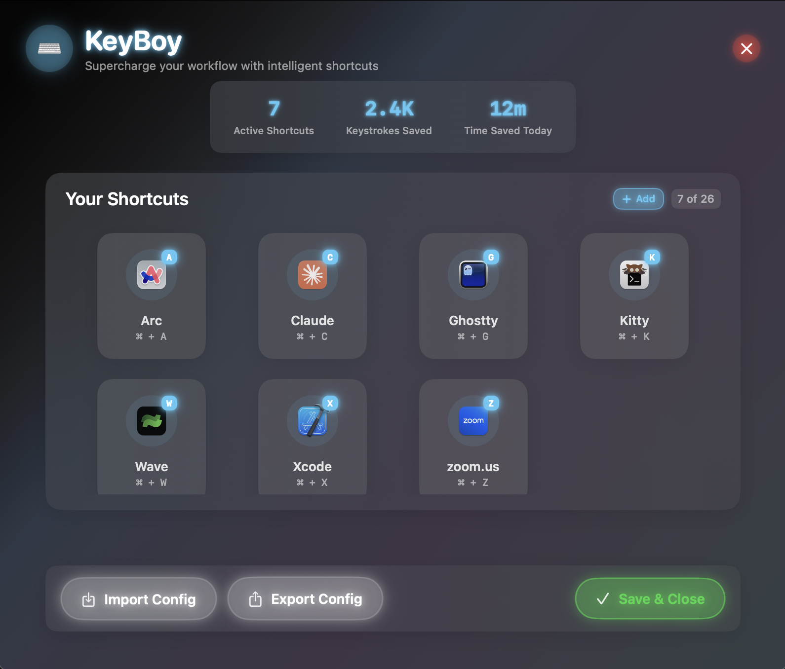
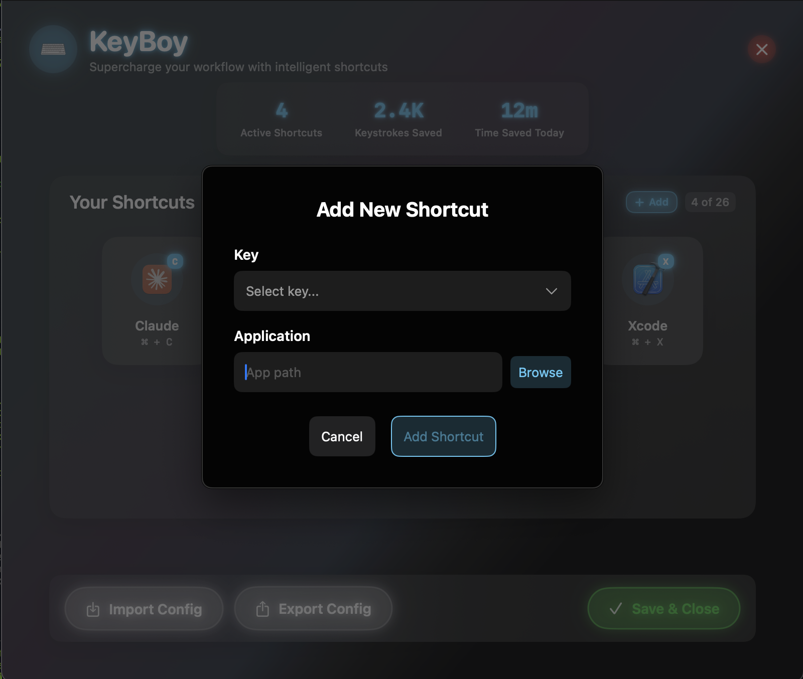

# KeyBoy ⌨️

**Lightning-fast macOS app switching with Right CMD shortcuts**

A beautifully crafted menu bar application that transforms your productivity workflow. Switch between applications instantly using Right CMD + letter combinations while keeping your Left CMD functionality completely intact.

  

> 🤖 **Built entirely with Claude Code** - Showcasing the power of AI-assisted development from concept to production

## 📸 Screenshots

### Futuristic Configuration Interface



*Glass morphism design with neon accents for a premium feel*

### Smart App Discovery



*Intelligent app detection with icon extraction and path validation*

## ✨ What Makes KeyBoy Special

🎯 **Surgical Precision**: Only hijacks Right CMD - your Left CMD shortcuts work exactly as before  
🔮 **Futuristic UI**: Glass morphism interface with smooth animations and neon glows  
⚡ **Instant Hot Reload**: Configuration changes apply immediately, no restart needed  
🧠 **Smart Detection**: Automatically extracts app icons, names, and validates paths  
🎨 **Dual Modes**: Visual editor for simplicity, JSON mode for power users  
🔒 **Privacy First**: Zero network access, no telemetry, completely offline  

## 🚀 Quick Start

### Installation

```bash
# Download latest release
curl -L -o KeyBoy.dmg https://github.com/naveedehmad/KeyBoy/releases/latest/download/KeyBoy.dmg

# Or clone and build
git clone https://github.com/naveedehmad/KeyBoy.git
cd KeyBoy && ./create-dmg.sh
```

### First Launch

1. **Launch** KeyBoy → ⌨️ appears in menu bar
2. **Grant** Accessibility permissions when prompted
3. **Test** default shortcuts: Right CMD + K/A/S/C/Z

### Default Shortcuts Out of the Box

| Combo | Application | Purpose |
|-------|------------|---------|
| `Right CMD + G` | Ghostty | Terminal |
| `Right CMD + A` | Arc | Browser |
| `Right CMD + S` | Slack | Communication |
| `Right CMD + C` | Claude | AI Assistant |
| `Right CMD + Z` | Zoom | Video Calls |

## 🎨 Configuration

### Visual Mode (Recommended)

Click ⌨️ in menu bar → **"Edit Shortcuts"**

- **Glass morphism interface** with smooth animations
- **Drag & drop** app selection from Applications folder  
- **Real-time validation** prevents configuration errors
- **App icon extraction** for visual shortcut management
- **One-click** add/edit/remove shortcuts

### JSON Mode (Power Users)

Direct configuration file editing:

```json
{
  "shortcuts": {
    "k": "/Applications/Ghostty.app",
    "a": "/Applications/Arc.app", 
    "s": "/Applications/Slack.app",
    "c": "/Applications/Claude.app",
    "z": "/Applications/zoom.us.app",
    "x": "/Applications/Xcode.app"
  },
  "settings": {
    "showNotifications": true,
    "playSound": false
  }
}
```

## 🛠️ Technical Architecture

### Core Components

```
KeyBoy/
├── 🔥 HotkeyMonitor     # Precise Right CMD detection
├── ⚙️ ConfigManager     # Hot-reload configuration  
├── 🚀 AppLauncher       # Smart app switching
├── 🎨 FuturisticUI      # Glass morphism interface
└── 🔍 AppIconExtractor  # Icon & metadata extraction
```

### Key Technical Innovations

- **Hardware key code detection** (54=Right CMD, 55=Left CMD)
- **Event tap hijacking** with selective suppression
- **File system monitoring** for configuration hot-reload
- **Bundle introspection** for app metadata extraction

## ⚠️ Troubleshooting

### Shortcuts Not Working?

The #1 issue is **macOS permission caching**. Here's the bulletproof fix:

1. **System Settings** → **Privacy & Security** → **Accessibility**
2. **Remove KeyBoy** from the list (click ➖ button)  
3. **Restart KeyBoy** → Grant permissions again
4. **Test shortcuts** → Should work immediately

This forces macOS to refresh its permission cache.

### Debug Console

```bash
# View real-time KeyBoy logs
log stream --predicate 'subsystem contains "KeyBoy"' --info

# Expected working output:
# ✅ KeyBoy hotkey monitoring started successfully!
# 🎯 Right CMD + k detected!
# ✅ Launching: /Applications/Ghostty.app
```

### Common Issues & Solutions

| Problem | Root Cause | Solution |
|---------|------------|----------|
| "Failed to create event tap" | Missing permissions | Grant Accessibility access |
| "Permissions granted but not working" | macOS cache bug | Remove/re-add from Accessibility |
| "Right CMD not detected" | Hardware detection issue | Check Console logs |
| "App won't launch" | Invalid path | Verify app exists at path |
| "Left CMD affected" | Logic error | Check HotkeyMonitor implementation |

## 🔒 Security & Privacy

- ✅ **Zero network access** - Works completely offline
- ✅ **No data collection** - Zero telemetry or analytics
- ✅ **Minimal permissions** - Only Accessibility for key monitoring  
- ✅ **Open source** - Full transparency, audit-ready code
- ✅ **Sandboxed** - App sandbox disabled only for file access

## 🏗️ Development

### Build Requirements

- macOS Sequoia 15.0+
- Xcode 15.0+
- Right CMD key (obviously! 😄)

### Quick Development Setup

```bash
git clone https://github.com/naveedehmad/KeyBoy.git
cd KeyBoy

# Open in Xcode
open KeyBoy.xcodeproj

# Or build via CLI
xcodebuild -scheme KeyBoy -configuration Release

# Create distributable DMG
./create-dmg.sh
```

### Testing Checklist

- [ ] Right CMD + letter → hijacked (app launches)
- [ ] Left CMD + letter → normal macOS behavior  
- [ ] Menu bar icon appears correctly
- [ ] Configuration editor opens and functions
- [ ] Hot-reload works without restart
- [ ] All shortcuts in config work properly

## 🚢 Release Process

This project follows a clean release workflow:

1. **Development** on feature branches
2. **PR merge** to main triggers new version
3. **Automated builds** create distributable DMG  
4. **GitHub releases** with changelog and assets

## 🤝 Contributing

KeyBoy welcomes contributions! Here's how:

1. **Fork** the repository
2. **Create** feature branch: `git checkout -b feature/amazing-feature`
3. **Implement** your changes with tests
4. **Follow** existing code patterns and conventions
5. **Submit** pull request with clear description

### Development Philosophy

- **Minimal scope** - Focus on core functionality
- **User experience first** - Polish over features
- **Defensive coding** - Comprehensive error handling
- **Performance conscious** - Efficient resource usage

## 🎯 Roadmap

### v2.0 (Planned)

- [ ] Multiple modifier support (CMD+Shift+letter)
- [ ] Sequence-based shortcuts (like Vim)
- [ ] Per-app context awareness
- [ ] Launch at login integration
- [ ] Custom shortcut groups/workspaces

### Community Requests

- [ ] Terminal integration for CLI app launching
- [ ] Workflow automation triggers
- [ ] Configuration sync across devices
- [ ] Shortcut conflict detection

## 📄 License

MIT License - See [LICENSE](LICENSE) for full details.

## 🙏 Acknowledgments

**KeyBoy** was crafted entirely using **Claude Code**, Anthropic's AI coding assistant, showcasing the remarkable potential of human-AI collaboration in software development.

### Development Story

- **Concept to Production**: Built from scratch with AI assistance
- **Architecture Design**: AI-guided technical decisions
- **UI/UX Implementation**: Glass morphism design by AI
- **Bug Resolution**: Collaborative debugging with AI
- **Polish & Documentation**: AI-enhanced user experience

This project stands as a testament to what's possible when human creativity meets AI capability.

## 🤖 Prompt

> i want to create a simple apple app of some sorts that let's me use the right side CMD key with combinations to quickly swith apps. e.g. right CMD + G to open Ghostty terminal, CMD + W to open Wave etc.. plan this out accordingly. it needs to be very minimal. needs to stay on the top menu  bar as an simple emoji and clicking on it opens sort of like a futuristic window that has the key combos as key and the way to select the app that we wanna open. let's keep it very simple. minimal UI but functional. don't over engineer anything. also tests are not too important for now as long as we can run it. start with a spec.
---

## 💡 Pro Tips

- **Use descriptive letters**: `g` for Ghostty, `x` for Xcode, `z` for Zoom.
- **Group by workflow**: Development apps on one side, communication on another
- **Test new shortcuts**: Always verify app paths before saving
- **Keep it simple**: 5-10 shortcuts are usually enough for most workflows

---

<div align="center">

**KeyBoy** - Because life's too short for slow app switching! ⚡

*Built with ❤️ and 🤖 Claude Code*

</div>
